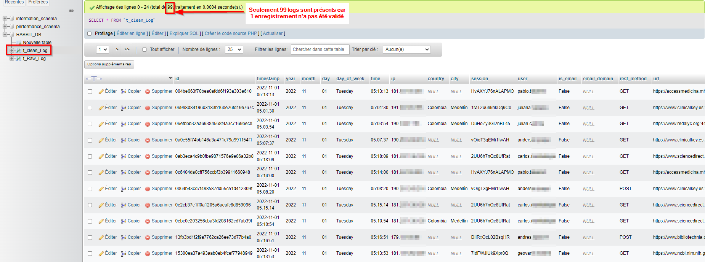

# Le projet - RabbitMQ

## Résumé 
Ce projet à but pédagogique à pour but de mettre en pratique les notions d'ORM, de data streaming, d'environement local / containerisé en python.

L'objectif est de simuler un scénario réel consistant à récupérer les logs d'un server web, les traiter et les stocker dans une base de données, et ce en temps réel.


## Prérequis

- Python 3.x
- Un outil de génération de conteneurs (type docker)
- Docker Compose


## Installation

Pour installer ce projet il vous faudra suivre les étape suivantes :

Cloner ce repo GitHub :
```bash
git clone https://github.com/malow106/DataStreaming_RabbitMQ
```

En ligne de commande, se placer dans le dossier du projet
```bash
cd DataStreaming_RabbitMQ
``` 

(Facultatif) Il est fortement conseillé de créer un environnement virtuel permettant d'isoler les packages python nécéssaires du reste de votre machine.
```bash
virtualenv venv
``` 
puis activer cet environnement :
```bash
venv\Scripts\activate (windows)
source venv/bin/activate (linux/Macos)
``` 

puis installer les packages python :
```bash
pip install -r requirements.txt
``` 

## Configuration et secrets

Pour renforcer la sécurité d'une application, vous ne devriez jamais mettre d'informatiosn sensibles en dur dans votre code.

Pour ce faire nous utilisons un systeème de variables d'environnements, qui ne sont pas poussés dans les différents repo et jamais partagés. D'habitude nosu utilisons un fichier nommé `.env`

Afin d'utiliser l'application, vous devez renommer le fichier `.env.example` en `.env` et saisir les différentes variables, soit :
```bash
# Utilisé par le conteneur rabbit MQ
RABBIT_USER=""   
RABBIT_PASSWORD=""

# Utilisé par le conteneur MySQL
DB_NAME=""
DB_USER=""
DB_PASSWORD=""
DB_ROOT_PASSWORD=""
``` 
## Services et utilisation

L'application utilise 3 services pour fonctionner. Ils seront conteneurisés pour simplifier leur déploiement sur n'importe quelle système.

- `MySQL`
    - C'est la base de donnée cible qui stockera les logs traités
- `PHPMyAdmin` (factultatif)
    - C'est l'interface graphique de la base de donnée
- `RabbitMQ`
    - C'est le service qui permet de 'streamer' les données depuis notre source (le server web) jusqu'à la desrtination (notre base MySQL)

### Lancement des services

Pour lancer ces 3 services :
- vérifiez que vous êtes bien placés dans le dossiers contenant le fichier `docker-compose.yml`
- effectuer la commande suivante : 
```bash
docker-compose up -d
```

### Utilisation de l'application

Une fois les 3 services ci-dessus lancés, il faut suivre les étapes suivantes.

#### 1- Lancer le server RabbitMR

Exécuter le fichier python `server.py` afin de créer une connexion au serveur via un `channel` pour qu'il soit utilisable par les `producers` et `consummer`.
```bash
python server.py
```


#### 2- Simuler les logs produit par le server web

Exécuter le fichier python `logs-producer.py` afin de créer un `exchange` et des `queue`. Cela permet ensuite de publier les logs dans les `queue` et de les aiguiller correctement à l'aide de `routing_key`.
```bash
python logs-producer.py
```

#### 3- Consommer les logs et les pousser dans notre base SQL

Exécuter le fichier python `consumer.py` afin de consommer les logs en attente dans nos deux `queue`. Les logs seront alors traités en FIFO (First In First Out) jusqu'a ce que les 2 `queue` soient vide.
```bash
python consumer.py
```
Pour chaque queue, nous applicons des traitements particulier avant de pousser un log dans la base de données :
- `process_msg_data_clean` : permet de 'parser' notre log à l'aide de fonctions et d'expressions régulière (RegEx) pour le stocker de manière structurée en base. Il pourra ainsi être facilement à des fins d'analyse, dashboarding ou ML.
- `process_raw_message` : permet de stoker notre log brut afin de ne pas le perdre.

Toutes les fonctions de traitement sont dans le fichier `\functions\Myfunctions.py`

#### 4- Chargement des logs dans notre base SQL

Pour intérragir avec les base MySQL nous utilisons SQLAlchemy, un ORM. Ce genre d'outil permet de grandement simplifier l'interface entre du code et une base de donnée.

La connexion à la base de donnée en python est effectuée dans le fichier `\functions\orm_conn.py`

Les 2 tables de la base sont représentées dans le fichier `\functions\models.py`

Il s'agit de la dernière étape de notre flux de données : les données consommées sont ainsi poussés dans notre base MySQL.

# Résultats (sur échantillon de 100 logs)

## RabbitMQ interface
Visualisation de la publication des logs dans la queue (front montant) et de leur consommation (front descandant)


Visualisation des logs dans PHPMyAdmin dans les 2 tables


Verification des données chargées


# Documentation et ressources utiles

[Doc RabbitMQ](https://www.rabbitmq.com/tutorials/tutorial-one-python.html)

[Playlist vidéo sur RabbitMQ](https://youtube.com/playlist?list=PLn6POgpklwWqiqKEriklbvbSd60-weOqh)

